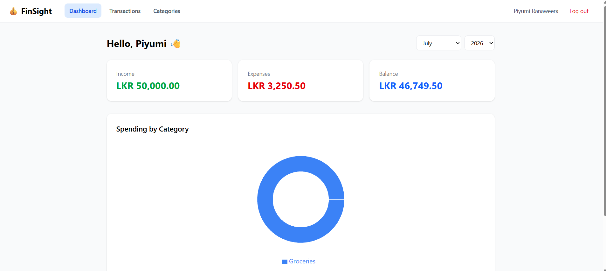
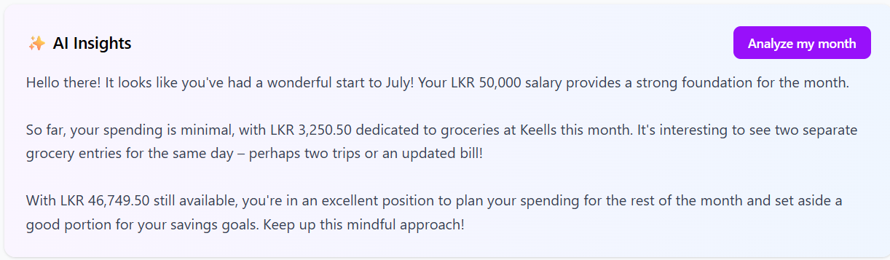
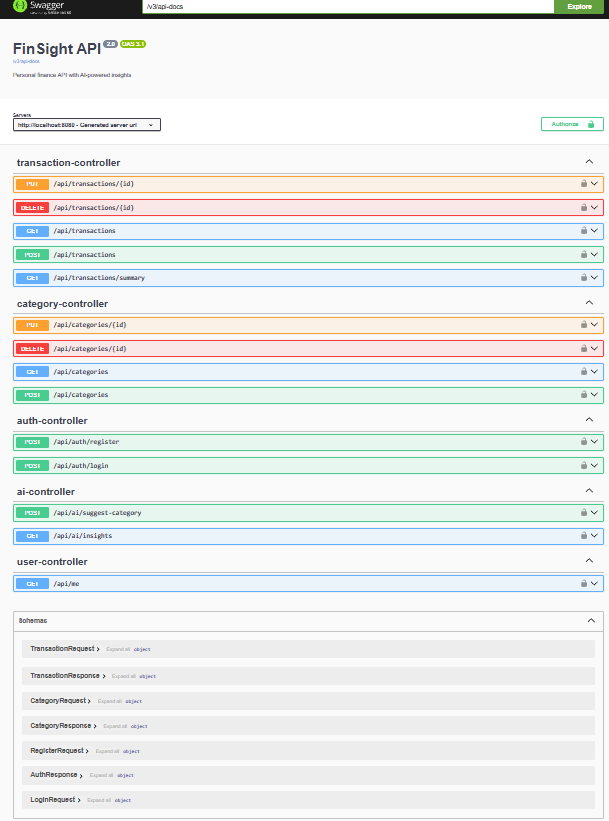

# 💰 FinSight

**AI-powered personal finance tracker** — built with Spring Boot 3, React 18, and Gemini AI.

Applies enterprise finance domain knowledge from my ERP internship (double-entry accounting,
audit-grade systems) to a consumer product, built end-to-end with professional engineering
practices: full test pyramid, CI/CD, and API-first design.

## ✨ Features

- **JWT authentication** — BCrypt-hashed credentials, stateless sessions, protected routes
- **Transaction management** — income/expense tracking with categories, LKR formatting, month filtering
- **Interactive dashboard** — monthly income/expense/balance cards + category breakdown chart (Recharts)
- **🤖 AI auto-categorization** — describe a transaction, Gemini picks the category
- **🤖 AI monthly insights** — natural-language analysis of your spending patterns
- **Polished UX** — toast notifications, inline form validation powered by structured API errors

## 🏗️ Architecture

## 🧪 Engineering Practices

- **Unit tests** — service layer tested in isolation with JUnit 5 + Mockito
- **Integration tests** — full HTTP flows against real PostgreSQL via **Testcontainers**
- **CI/CD** — GitHub Actions runs build + tests + lint on every PR; branch protection on `main`
- **Global exception handling** — consistent `ErrorResponse` contract with per-field validation errors
- **API documentation** — interactive Swagger UI at `/swagger-ui.html`
- **Health monitoring** — Spring Actuator endpoint at `/actuator/health`
- **Secrets management** — all credentials via environment variables, never committed

## 🛠️ Tech Stack

| Layer | Technology |
|---|---|
| Backend | Java 21, Spring Boot 3.5, Spring Security (JWT), Spring Data JPA |
| Frontend | React 18, Vite, Tailwind CSS 4, Recharts, react-hot-toast |
| Database | PostgreSQL 16 |
| AI | Google Gemini (gemini-2.5-flash) |
| Testing | JUnit 5, Mockito, AssertJ, Testcontainers |
| DevOps | GitHub Actions, Docker |

## 🚀 Getting Started

### Prerequisites
- Java 21, Node.js 22+, PostgreSQL 16, Docker (for integration tests)

### Setup

1. Create a PostgreSQL database named `finsight`
2. Set environment variables:
3. Backend: `cd finsight-backend && ./mvnw spring-boot:run` → http://localhost:8080
4. Frontend: `cd finsight-frontend && npm install && npm run dev` → http://localhost:5173

> Note: default DB port in config is 5433 — adjust `application.properties` if yours differs.

### Run tests

## 🗺️ Roadmap

- [ ] Refresh token rotation & rate limiting
- [ ] 📸 Receipt scanning (Gemini vision)
- [ ] Budgets with overspend projections
- [ ] Spending trend charts

---

*Built by [Piyumi Ranaweera](https://github.com/PiyumiRanaweera) — BSc (Hons) IT undergraduate, SLIIT*
