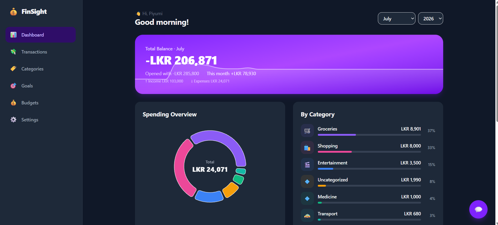
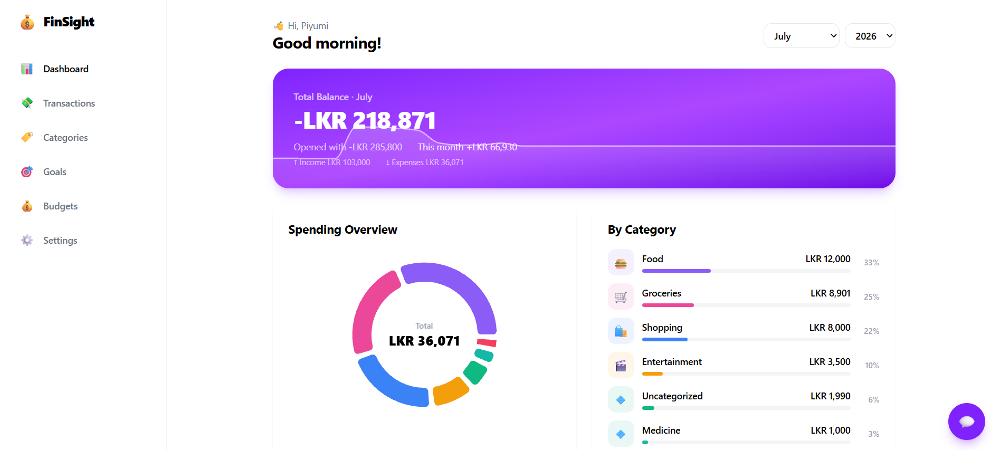
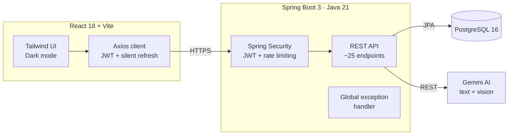
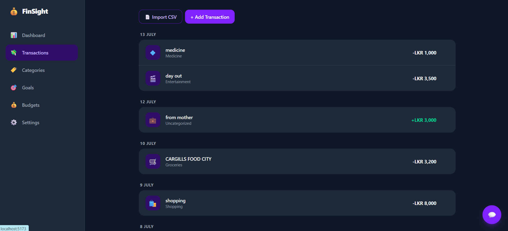
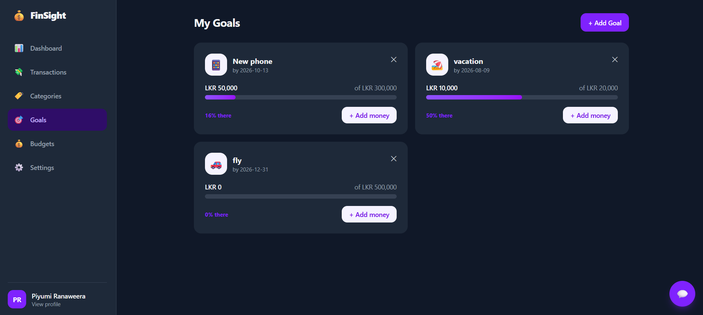

# 💰 FinSight


**AI-powered personal finance tracker** — Spring Boot 3, React 18, and Gemini AI, with a full fintech design system and dark mode.

Applies enterprise finance domain knowledge from my ERP internship (double-entry accounting,
audit-grade systems) to a consumer product, built end-to-end with professional engineering
practices: full test pyramid, CI/CD with branch protection, and API-first design.

**24 issues shipped across 5 milestones** — every feature followed a real workflow:
issue → feature branch → PR → CI checks → merge.



## ✨ Features

- **Interactive dashboard** — gradient balance hero with live sparkline, carry-over balances across months, category donut chart, 6-month income/expense trend
- **📸 Receipt scanning** — snap a photo, Gemini AI vision extracts amount, merchant, date & category automatically
- **📄 CSV bank statement import** — upload bank exports with flexible format detection; AI categorizes every transaction in a single batched call
- **💬 AI chat assistant** — ask questions about your finances ("how much did I spend on groceries?"), answered from your own transaction data with hallucination guardrails
- **🤖 AI auto-categorization & monthly insights** — natural-language analysis of spending patterns
- **Transaction management** — add/edit via modal, friendly date grouping ("Today", "Yesterday"), month filtering, LKR formatting
- **🎯 Savings goals** — targets with progress bars, deadlines, and add-money actions
- **💰 Budgets with smart projections** — "on pace to exceed by 15%" forecasting based on day-of-month pace, with ON TRACK / AT RISK / OVER states
- **👤 Account management** — editable profile, secure password change (current-password verification)
- **🌙 Dark mode** — full theme system with persistent preference
- **Polished UX** — toast notifications, inline form validation powered by structured API errors

| Light | Dark |
|---|---|
|  |  |

## 🏗️ Architecture



## 🔐 Security

- **JWT authentication** — BCrypt password hashing, stateless sessions, custom auth filter
- **Refresh token rotation** — 15-minute access tokens; refresh tokens rotate on every use and are revocable server-side; silent client-side renewal via axios interceptor
- **Rate limiting** — Bucket4j token-bucket on auth endpoints (5 attempts/minute per IP) against brute-force
- **User-scoped data access** — every query filtered by owner (IDOR protection by design)
- **Secrets management** — all credentials via environment variables, never committed

## 🧪 Engineering Practices

- **Unit tests** — service layer with JUnit 5 + Mockito
- **Integration tests** — full HTTP flows against real PostgreSQL via **Testcontainers**
- **CI/CD** — GitHub Actions on every PR (backend build + test, frontend lint + build); branch protection requires green checks to merge
- **Global exception handling** — consistent `ErrorResponse` contract with per-field validation errors
- **API documentation** — interactive Swagger UI at `/swagger-ui.html`
- **Health monitoring** — Spring Actuator at `/actuator/health`




## 🛠️ Tech Stack

| Layer | Technology |
|---|---|
| Backend | Java 21, Spring Boot 3.5, Spring Security (JWT), Spring Data JPA |
| Frontend | React 18, Vite, Tailwind CSS 4, Recharts, react-hot-toast |
| Database | PostgreSQL 16 |
| AI | Google Gemini (gemini-2.5-flash — text + vision) |
| Testing | JUnit 5, Mockito, AssertJ, Testcontainers |
| Security | JWT (JJWT), BCrypt, Bucket4j rate limiting |
| DevOps | GitHub Actions, Docker |

## 🚀 Getting Started

### Prerequisites
Java 21, Node.js 22+, PostgreSQL 16, Docker (for integration tests)

### Setup
1. Create a PostgreSQL database named `finsight`
2. Set environment variables: `DB_PASSWORD`, `JWT_SECRET`, `GEMINI_API_KEY`
3. Backend: `cd finsight-backend && ./mvnw spring-boot:run` → http://localhost:8080
4. Frontend: `cd finsight-frontend && npm install && npm run dev` → http://localhost:5173

> Default DB port in config is 5433 — adjust `application.properties` if yours differs.

### Run tests

```bash
cd finsight-backend
./mvnw test        # Windows: mvnw test
```

**17+ tests across two layers:**

| Layer | What's covered | Tools |
|---|---|---|
| Unit | AuthService (registration, login, BCrypt hashing, duplicate rejection), CategoryService (user-scoped CRUD, IDOR protection), RateLimitFilter (429 after 5 attempts) | JUnit 5, Mockito, AssertJ |
| Integration | Full HTTP flows — register → duplicate 409 → protected endpoint 403/200 → category + transaction creation — against a **real PostgreSQL** spun up in Docker | Testcontainers, TestRestTemplate |

> ⚠️ Integration tests require **Docker running** (Testcontainers starts a disposable `postgres:16-alpine` container per run).
> Unit tests run without Docker.

The same suite runs on every pull request via GitHub Actions — `main` is protected and only accepts green builds.

```bash
./mvnw test -Dtest='*ServiceTest'   # run only the fast unit tests (no Docker needed)
```

## 🗺️ Roadmap

- [x] Savings goals with progress tracking
- [x] Budgets with overspend projections
- [x] Profile & secure password change
- [x] Dark mode
- [x] Refresh token rotation & rate limiting
- [x] 📸 Receipt scanning (Gemini vision)
- [x] 📄 CSV import with batch AI categorization
- [x] 💬 AI chat assistant grounded in user data
- [x] Balance carry-over across months
- [x] 6-month spending trend chart
- [ ] 📅 Calendar view with future pending transactions
- [ ] Recurring transaction detection
- [ ] Docker Compose deployment + live demo

---

*Built by [Piyumi Ranaweera](https://github.com/PiyumiRanaweera) — BSc (Hons) IT undergraduate, SLIIT · [Portfolio](https://piyumi-ranaweera.netlify.app)*